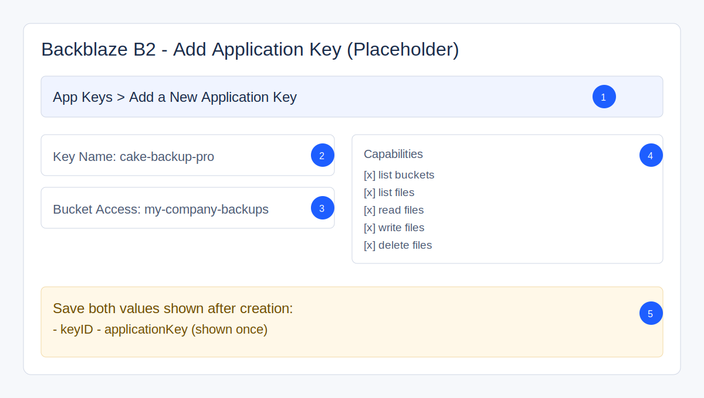
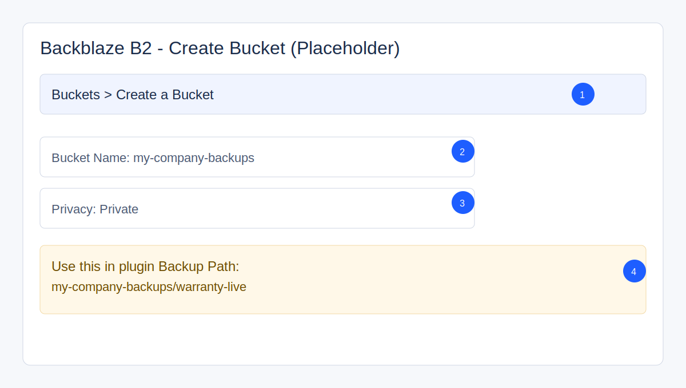

# CakeBackupPro

CakePHP backup/restore plugin for Backblaze B2 with:

- one-click full restore
- component-level backup/restore
- URL rewrite on restore (source -> target domain)
- safe file rollover (`old-*`) before replacement
- post-restore health checks

## Version Map

| Branch | CakePHP | PHP | Plugin Status |
| --- | --- | --- | --- |
| `main` | `^5.0` | `>=8.1` | Active |
| `1.x` | `^4.5` | `>=8.1` | Legacy/Maintenance |

## 1. Quick Install

```bash
composer require cakebackuppro/cake-backup-pro
```

In `src/Application.php`:

```php
$this->addPlugin('CakeBackupPro', ['routes' => true]);
```

Run plugin migrations:

```bash
bin/cake migrations migrate -p CakeBackupPro
```

Open:

- `/admin/backups`

## 2. Backblaze Requirements (What You Must Have)

Before plugin setup, you need all 4:

1. Backblaze B2 account
2. A B2 bucket (already created)
3. An Application Key ID
4. An Application Key (secret value)

If any of these are missing, backups will fail.

### 2.1 Create bucket in Backblaze

In Backblaze B2:

1. `Buckets` -> `Create a Bucket`
2. Choose a unique bucket name, for example: `my-company-backups`
3. Keep the bucket private

### 2.2 Create application key in Backblaze

In Backblaze B2:

1. `App Keys` -> `Add a New Application Key`
2. Recommended: restrict the key to this backup bucket
3. Required capabilities:
- list buckets
- list files
- read files
- write files
- delete files
4. Save both values:
- `keyID`
- `applicationKey` (shown once)

## 3. What To Enter In `/admin/backups`

Use this exact mapping:

- `Backblaze Key ID` -> your B2 `keyID`
- `Backblaze Application Key` -> your B2 `applicationKey`
- `Backup Path (bucket/prefix)` -> `bucket-name/folder-prefix`

Examples:

- `my-company-backups/warranty-live`
- `my-company-backups/sites/site-a`

Important:

- First part must be a real bucket name.
- Second part is a folder prefix inside that bucket.
- Do not include `b2://`, `https://`, or full URLs.

Set also:

- region (default `us-west-004` unless your account uses another)
- retention days
- schedule frequency/time

Then click:

- `Validate Connection`

## 4. First Successful Backup (10-Minute Checklist)

1. Complete config in `/admin/backups`
2. Click `Validate Connection`
3. Run `DB` backup
4. Confirm `logs/backup-manager.log` shows upload success
5. Run `Full` backup
6. Confirm files appear in Backblaze under:
- `YYYYMMDD-HHMMSS/YYYYMMDD-HHMMSS-...`

If this works, your setup is correct.

## 5. Required Server Binaries

- `bash`
- `curl`
- `php`
- `mysqldump`
- `mysql`
- `tar`
- `gzip`

Optional:

- `composer` (used if post-restore composer is enabled)

## 6. Backup Layout In Backblaze

Each backup set is isolated in its own folder:

- `YYYYMMDD-HHMMSS/YYYYMMDD-HHMMSS-db.sql.gz`
- `YYYYMMDD-HHMMSS/YYYYMMDD-HHMMSS-<component>.tar.gz`
- `YYYYMMDD-HHMMSS/YYYYMMDD-HHMMSS-meta.json`

Example:

- `20260219-091237/20260219-091237-env_files.tar.gz`

## 7. Backup Types

- `full`: DB + selected file components
- `db`: DB only
- `files`: selected file components only

## 8. One-Click Full Restore

One-click restore from admin:

- restores DB + core components
- rewrites URLs to current environment URL
- runs migrations
- clears cache
- runs health checks
- can include env files if selected

## 9. CLI Script (Optional)

Script path:

- `plugins/CakeBackupPro/scripts/backup-manager.sh`

Examples:

```bash
./plugins/CakeBackupPro/scripts/backup-manager.sh backup full --prune
./plugins/CakeBackupPro/scripts/backup-manager.sh list-sets
./plugins/CakeBackupPro/scripts/backup-manager.sh restore-full latest
```

## 10. Logs

- backup log: `logs/backup-manager.log`
- restore log: `logs/backup-restore.log`
- staging: `tmp/backups`

## 11. Most Common Setup Errors

### `Validation failed` or cannot list snapshots

Usually one of:

- wrong Key ID
- wrong Application Key
- wrong `bucket/prefix` format
- key does not have required capabilities
- key restricted to a different bucket

### `mysqldump: Access denied`

- check DB credentials in app env/config
- use `DB_*_FALLBACKS` if host varies between environments

### `/admin/backups` missing

- confirm plugin load:

```php
$this->addPlugin('CakeBackupPro', ['routes' => true]);
```

## 12. Security Notes

- never commit real keys/passwords
- lock env files (`chmod 600`)
- treat backup archives as sensitive
- test restore in non-production first

## 13. Visual Setup Guide (Replaceable Screenshots)

These images are placeholders shipped with the plugin so new users always have a visual path.
Replace them with real screenshots from your Backblaze and admin UI when publishing docs.

### 13.1 Backblaze: Create App Key



Callouts:

1. Open `Backblaze B2 -> App Keys -> Add a New Application Key`
2. Set key name (example: `cake-backup-pro`)
3. Restrict to your backup bucket
4. Enable capabilities: list/read/write/delete files + list buckets
5. Save both values: `keyID` and `applicationKey`

### 13.2 Backblaze: Create Bucket



Callouts:

1. Open `Backblaze B2 -> Buckets -> Create a Bucket`
2. Choose unique name (example: `my-company-backups`)
3. Keep bucket private
4. Copy bucket name for plugin `Backup Path`

### 13.3 CakeBackupPro: Admin Form Mapping


Callouts:

1. `Backblaze Key ID` = Backblaze `keyID`
2. `Backblaze Application Key` = Backblaze `applicationKey`
3. `Backup Path` = `bucket-name/prefix`
4. Set schedule/time/retention
5. Click `Validate Connection`
6. Run `DB` backup, then `Full` backup
